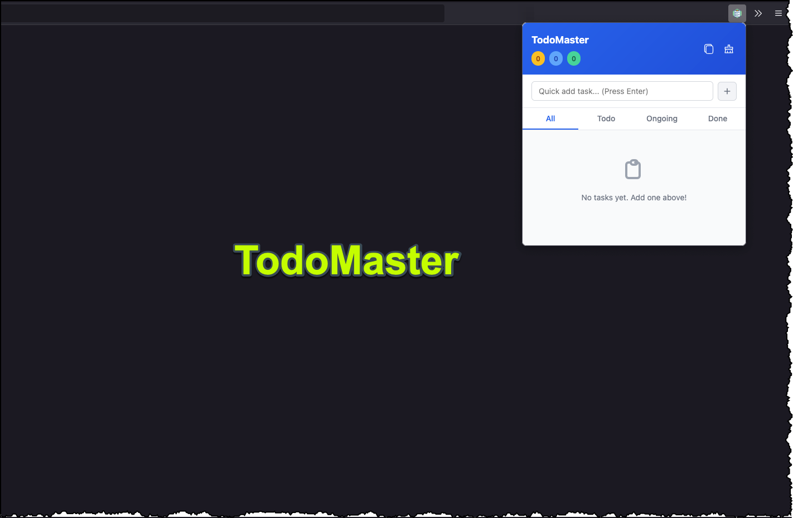
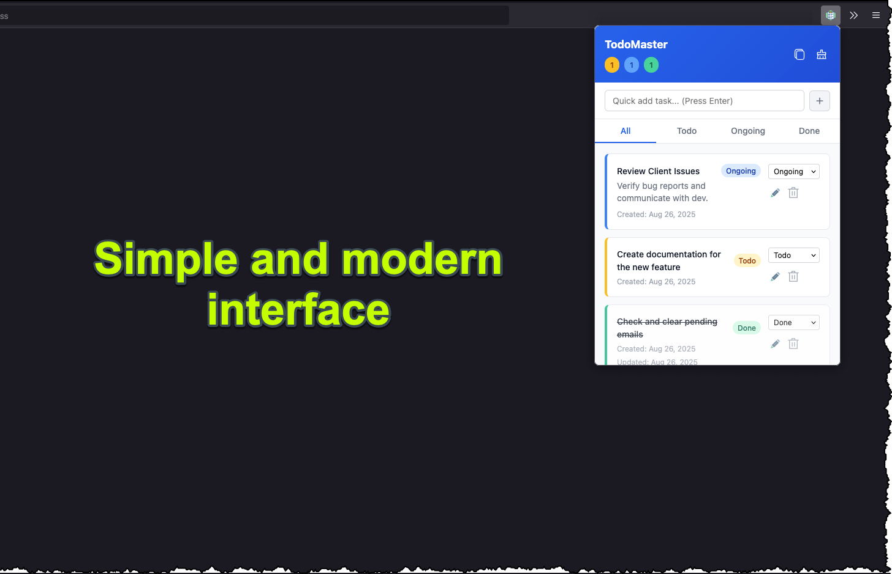

# TodoMaster 🚀

A modern, lightweight todo manager Firefox extension with privacy-focused local storage and advanced task management features.

 


## ✨ Features

### Core Functionality
- **📝 Smart Task Management**: Create, edit, and delete tasks with ease
- **🔄 Three Status System**: Todo → Ongoing → Done workflow
- **🔍 Powerful Search**: Search through task titles and notes instantly
- **📅 Date Tracking**: GMT+6 timezone support with creation/update timestamps
- **💾 Persistent Storage**: Data survives browser restarts and updates
- **🎨 Modern Design**: Clean, responsive interface built with modern CSS

### Advanced Features
- **⚡ Smart Sorting**: Automatically prioritizes ongoing tasks, moves completed to bottom
- **📊 Live Counters**: Real-time task count by status
- **📤 Export/Import**: Backup and restore your tasks in JSON format
- **⌨️ Keyboard Shortcuts**: Efficient navigation and task management
- **🔐 Privacy First**: All data stored locally, no cloud dependencies
- **🎯 Instant Actions**: Quick status changes and in-place editing
## 🎨 Screenshots & Demo


### Main Interface

#### Live Demo


#### Empty state:


#### With tasks:


#### Search Functionality


Watch our full demo video [here](screenshots/04-demo.mp4)

## 🚀 Installation

1. Download the latest release or clone this repository
2. Open Firefox and go to `about:debugging`
3. Click "This Firefox" → "Load Temporary Add-on"
4. Select the `manifest.json` file
5. The TodoMaster icon will appear in your toolbar

## 📖 Usage

### Basic Operations
- **Add Task**: Type in the input field and press Enter or click "Add Task"
- **Change Status**: Use the dropdown to move tasks between Todo/Ongoing/Done
- **Edit Task**: Click the edit icon to modify title and notes
- **Delete Task**: Click the delete icon and confirm
- **Search**: Type in the search bar to find tasks by title or content
<!-- 
### Keyboard Shortcuts
- `Ctrl/Cmd + Enter`: Add new task (when title field is focused)
- `Ctrl/Cmd + F`: Focus search bar
- `Escape`: Cancel edit mode or clear search
-->

### Data Management
- **Export**: Click export icon to download tasks as JSON
- **Import**: Click import icon to load tasks from JSON file
- **Clear Done**: Remove all completed tasks at once

## 🎯 Task Workflow

```
📋 Todo → ⚡ Ongoing → ✅ Done
```

- **Todo**: New tasks start here
- **Ongoing**: Tasks you're actively working on
- **Done**: Completed tasks (automatically sorted to bottom)

## 🔧 Technical Details

### Architecture
- **Frontend**: Vanilla JavaScript (ES6+), HTML5, CSS3
- **Storage**: Firefox Extension Storage API
- **Security**: CSP compliant, XSS protection
- **Performance**: <1MB total size, <200ms popup load

### Browser Support
- Firefox 88+ (Manifest V2)
- Responsive design for various screen sizes

### Data Format
Tasks are stored locally with the following structure:
```json
{
  "id": "timestamp",
  "title": "Task title",
  "notes": "Optional notes",
  "status": "todo|ongoing|done",
  "createdAt": "ISO timestamp",
  "updatedAt": "ISO timestamp"
}
```

## 🛡️ Privacy & Security

- **100% Local Storage**: No data ever leaves your browser
- **No External APIs**: Completely offline functionality
- **Secure Input**: XSS protection and input sanitization
- **No Tracking**: Zero analytics or user tracking

## 📁 File Structure

```
TodoMaster/
├── manifest.json           # Extension manifest
├── popup.html             # Main popup interface
├── popup.js               # Core application logic
├── styles.css             # Modern styling
├── background.js          # Background processes
├── icons/                 # Extension icons
│   ├── icon-16.png
│   ├── icon-32.png
│   ├── icon-48.png
│   └── icon-128.png
├── docs/                  # Documentation assets
└── README.md
```

## 🔄 Changelog

### v1.0.0 (Current)
- ✅ Three-status system (Todo/Ongoing/Done)
- ✅ Advanced search functionality
- ✅ GMT+6 timezone support
- ✅ Smart task sorting
- ✅ Enhanced data persistence
- ✅ Improved responsive design
- ✅ Live task counters
- ✅ Basic todo functionality
- ✅ Local storage
- ✅ Export/Import
- ✅ Modern UI

## 🤝 Contributing

We welcome contributions! Please see our [Contributing Guidelines](CONTRIBUTING.md) for details.

### Development Setup
1. Clone the repository
2. Make your changes
3. Test in Firefox developer mode
4. Submit a pull request

### Reporting Issues
- Use the [GitHub Issues](https://github.com/your-username/todomaster/issues) page
- Provide detailed steps to reproduce
- Include browser version and extension version

## 📋 Roadmap

See our [Product Requirements Document](PRD.md) for detailed future plans including:
- Dark mode theme
- Categories and tags
- Due dates and reminders
- Productivity analytics
- Sync across devices

## 📄 License

This project is licensed under the MIT License - see the [LICENSE](LICENSE) file for details.

## 🙏 Acknowledgments

- Icons from [Heroicons](https://heroicons.com/)
- Design inspiration from modern task management apps
- Firefox extension documentation and community

## 💡 Tips & Tricks

1. **Quick Status Change**: Use the dropdown to rapidly move tasks through workflow
2. **Search Everything**: Search works on both titles and notes content
3. **Bulk Operations**: Use "Clear Done" to remove multiple completed tasks
4. **Backup Regularly**: Export your tasks periodically as backup
5. **Keyboard Navigation**: Learn the shortcuts for faster task management

---

Made with ❤️ for productivity enthusiasts who value privacy and simplicity.

**Download from Firefox Add-ons Store** (Coming Soon)